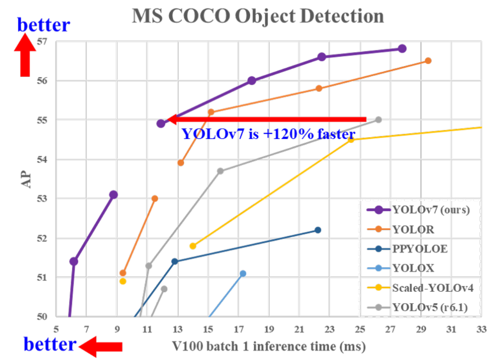
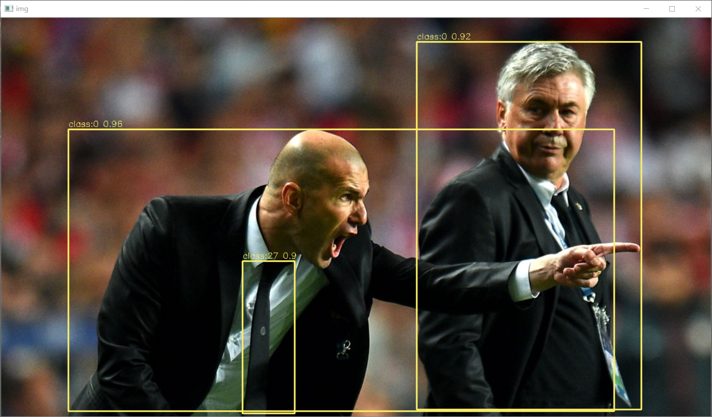

## B站教学视频

Coming soon

## Introduction

**YOLOv7**是YOLOv4的原班人马(**Alexey Bochkovskiy**在内)创造的目标检测模型，在保证精度的同时大幅降低了参数量，本仓库实现**YOLOv7的tensorrt部署**。

<div align="center">

</div>

## Environment

- Tensorrt 8.4.1.5
- Cuda 10.2 Cudnn 8.4.1
- onnx 1.12.0
- onnx-simplifier 0.3.10
- Torch 1.7.1

## Benchmark

|    Model    | Size | mAP<sup>test</sup> 0.5:0.95 | GTX1650 FP16(ms) | GTX1650 FP32(ms) |
| :---------: | :--: | :-------------------------: | :--------------: | :--------------: |
| YOLOv7-tiny | 640  |            38.7             |       8.7        |       11.6       |
|   YOLOv7    | 640  |            51.4             |       27.2       |       47.5       |
|  YOLOv7-X   | 640  |            53.1             |       44.2       |       82.9       |

说明：此处FP16,fp32预测时间包含**preprocess+inference+nms**，测速方法为warmup10次，预测100次取平均值，并未使用trtexec测速，与官方测速不同；mAP<sup>val</sup>为原始模型精度，转换后精度未测试。

## Quick Start

下载**YOLOv7**仓库。

```
git clone https://github.com/WongKinYiu/yolov7
```

将本仓库的**EfficientNMS.py**和**export_onnx.py**复制到**yolov7**下，导出含有EfficientNMS的ONNX模型。

```
python export_onnx.py --weights ./weights/yolov7.pt
```

将生成的**onnx**模型复制到**tensorrt/bin**文件夹下，使用官方**trtexec**转化添加完EfficientNMS的onnx模型。**FP32预测删除`--fp16`参数即可**。

```
trtexec --onnx=./yolov7.onnx --saveEngine=./yolov7_fp16.engine --fp16 --workspace=200
```

等待生成序列化模型后，修改本仓库**infer.py模型路径和图片路径**。

```
trt_engine = TRT_engine("./trt_model/yolov7_fp16.engine")
img1 = cv2.imread("./pictures/zidane.jpg")
```

```
python infer.py
```

<div align="center">

</div>


## Reference

https://github.com/WongKinYiu/yolov7

https://github.com/ultralytics/yolov5

https://github.com/Linaom1214/tensorrt-python

https://github.com/triple-Mu
